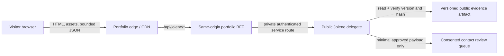
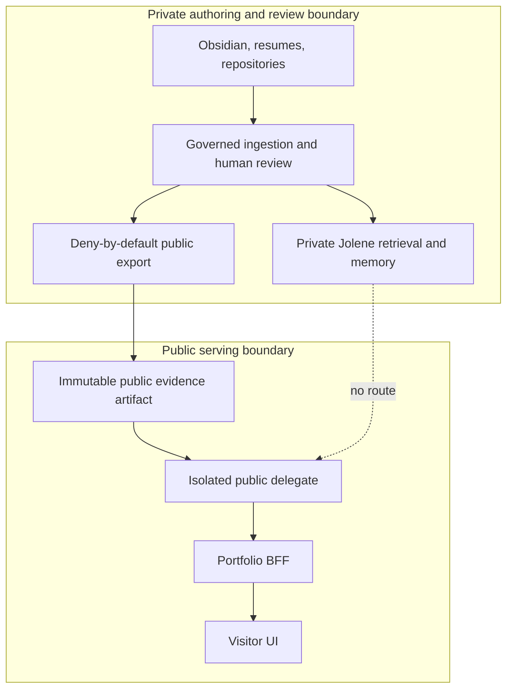

# Public Jolene deployment architecture

Status: implemented and verified for local integration; production topology approval, deployment, and public enablement remain open.

Owner: portfolio runtime and browser experience — portfolio workstream; public evidence export and delegate — Jolene workstream; production enablement — Carl Welch.

Current implementation truth: the portfolio contains a disabled-by-default same-origin BFF, strict contract fixtures, live adapter, job-fit/contact flows, security controls, citation navigation, sanitized operational events, and a repeatable evaluation harness. `JOL-CAREER-004` now produces the reviewed schema `1.0.0` public artifact with 41 active public claims at corpus `career:3d3b0d7361be5cfae3c634013bc48b73983388d3207d8f9b7bb1aaf50fa5c5de`. `JOL-CAREER-005` runs as an isolated Docker service on host loopback and implements the frozen manifest, answer, job-fit, and contact-intent contracts. The portfolio has validated that exact local boundary. No delegate hostname is deployed, no public route is enabled, and no launch is authorized.

## Decision

The portfolio and public Jolene delegate remain separate deployable systems. The browser talks only to the portfolio origin. A same-origin portfolio backend-for-frontend (BFF) validates and minimizes requests before calling the public delegate over a private service-to-service route. The delegate reads only a versioned, immutable export containing active `public_approved` evidence.

The public path has no network, filesystem, database, MCP, or credential route to private Jolene, its SQLite database, Slack context, durable memory, or Carl's Obsidian vault.

Contact intent is shown for completeness but remains a separately gated future capability. The current portfolio fixture adapter performs no network call or outbound action.

## Truth boundaries

- The export pipeline is the only bridge between the private and public evidence planes.
- Export is deny-by-default. Zero approved claims must produce a valid empty corpus, not a fallback to private data.
- The public delegate verifies schema version, corpus version, content hash, review state, and evidence references before serving a response.
- The portfolio treats job descriptions and questions as untrusted ephemeral input. It does not retain full transcripts or job descriptions by default.
- Every supported material claim returns evidence IDs, citations, evidence strength, maturity, limitations, and the corpus version used.
- Contact is a minimized, consented, reviewable handoff. Neither the UI nor delegate may apply, email, schedule, negotiate, promise availability, relocation, or compensation, or message recruiters for Carl.

## Runtime components

| Component | Responsibility | State | Network exposure |
| --- | --- | --- | --- |
| Portfolio application | Server-rendered portfolio, static assets, fixture/live UI | Implemented locally and in Docker | Public only after release approval |
| Portfolio BFF | Same-origin validation, redaction, admission, timeout, response normalization, live/fixture switch | Implemented, locally integrated, and disabled by default | Public same-origin route after enablement; private egress to delegate |
| Public Jolene delegate | Evidence-grounded answer and job-fit behavior against the public artifact | Implemented and verified as an isolated loopback Docker service; not deployed publicly | Private service network only |
| Public evidence artifact | Immutable, versioned, content-minimized reviewed evidence | Implemented; reviewed corpus contains 41 public claims and zero revocations | Readable only by delegate and authorized release tooling |
| Contact review queue | Durable minimal contact intent awaiting Carl's review | Implemented locally and disabled for portfolio evaluation; production retention and operations remain gated | No direct browser access |
| Private Jolene | Private agent, career registry, retrieval, memory, Slack, Obsidian access | Separate private system | Never reachable from the public plane |

Docker remains the reproducible build and verification path. The current Compose file intentionally contains only the portfolio container. A delegate service must not be added to portfolio Compose until the public image, service contract, secrets, network policy, and deployment topology have passed their own gates.

## Request path

1. The browser sends a bounded same-origin request to the portfolio BFF.
2. The BFF rejects unsupported content types, oversized bodies, unknown fields, unsafe encodings, and unavailable or disabled operation modes before upstream work.
3. The BFF assigns an opaque request ID, applies per-origin admission and cost policy, strips disallowed headers, and forwards only the validated contract payload.
4. The delegate revalidates the payload, verifies the public artifact, performs bounded retrieval/generation, and returns a versioned structured response.
5. The BFF validates the response contract and corpus compatibility before returning content to the browser. Invalid, stale, or incompatible responses fail closed to a non-disclosing degraded state.
6. Logs and metrics retain bounded operational metadata only. Questions, job descriptions, transcript text, contact-message content, evidence excerpts, session tokens, and authorization values are excluded.

The browser never receives delegate credentials or a delegate hostname. Direct browser-to-delegate CORS is not part of this design.

## Security and privacy controls

### Admission and abuse

- Default-off runtime kill switches at both BFF and delegate boundaries.
- Request body, header, URL, duration, and concurrency limits.
- Layered rate limits: coarse edge protection, per-session or privacy-preserving client admission at the BFF, and global/per-source defense at the delegate.
- Fixed per-request and per-session token/cost ceilings with no automatic budget expansion.
- Strict JSON schemas with unknown-field rejection and safe non-disclosing `400`, `413`, `415`, `429`, `503`, and version-mismatch responses.
- Prompt injection and private-data requests remain untrusted content, never instructions or authorization.
- No arbitrary tools, browsing, code execution, private repository access, or unrestricted retrieval in the public delegate.

### Data minimization

- No job-description or full-transcript persistence by default.
- No request or response payload logging.
- Query strings are not used for visitor content and are redacted from telemetry.
- Session identifiers are opaque, short-lived, scoped to the public experience, and contain no personal data.
- Contact data is collected only after a visitor sees the exact payload and gives explicit consent. Retention, deletion, access, spam handling, and breach procedures must be approved before this route is enabled.

### Secrets and isolation

- Browser-visible `NEXT_PUBLIC_` configuration contains no secret or delegate credential.
- BFF-to-delegate authentication uses a deploy-time secret or workload identity, rotated independently by environment.
- Development, preview, and production use separate credentials, budgets, artifact locations, queues, and telemetry projects.
- Containers run non-root with read-only roots, dropped capabilities, no privilege escalation, bounded temporary storage, and no private host mounts.
- The public delegate receives no private Jolene database URL, vault path, Slack token, private model memory, or general filesystem credential.

## Observability

Telemetry answers operational questions without reconstructing visitor content.

### Structured events

Allowed fields include:

- timestamp, environment, service, release, route, method, status class;
- opaque request/trace ID, fixture/live mode, schema version, corpus version;
- duration bucket, response state, citation count, requirement count;
- admission outcome, retry class, model/provider class, bounded token/cost totals; and
- kill-switch state and dependency health category.

Prohibited fields include prompt text, job descriptions, transcript text, contact fields, evidence text, source paths, session tokens, cookies, IP addresses in application logs, authorization headers, and raw request or response bodies.

### Metrics and alerts

- request count, success/degraded/refusal/error rates, and latency percentiles by route;
- contract/version failures, artifact verification failures, citation-resolution failures, and no-evidence rate;
- rate-limit, concurrency, timeout, budget, and kill-switch activations;
- provider latency/error/cost where a model is later enabled; and
- contact queue age and delivery failures without contact content.

Alert on sustained availability failure, artifact verification failure, unexpected cost acceleration, contract incompatibility, queue delivery failure, or evidence/citation integrity failure. A high no-evidence rate is a product-review signal, not permission to broaden retrieval.

Distributed traces may cross the BFF and delegate using opaque trace context. Trace attributes follow the same prohibited-field policy. Sampling must be bounded and must not capture payloads.

## Health, failure, and ownership

| Failure | User behavior | Automatic action | Owner |
| --- | --- | --- | --- |
| Delegate disabled or unavailable | Accessible degraded message; portfolio remains usable | Fail closed; bounded retry only for safe reads | Jolene service owner |
| Public artifact missing, invalid, or tampered | No answer; never fall back to private data | Disable live mode and alert | Jolene evidence owner |
| Schema or corpus mismatch | Version-mismatch state | Stop serving incompatible responses | Portfolio and Jolene contract owners |
| Provider timeout or budget ceiling | Bounded unavailable state with fixture-free copy | Cancel upstream work; open circuit if sustained | Jolene service owner |
| BFF validation or admission rejection | Specific safe client state | No delegate request | Portfolio owner |
| Contact delivery failure | Do not claim submission succeeded | Preserve only the consented minimal record according to approved policy; alert | Contact owner |
| Portfolio failure | Static error/rollback path | Roll back portfolio independently | Portfolio owner |

The portfolio and delegate deploy and roll back independently. The BFF must support disabling live Jolene without rolling back the portfolio. Artifact versions are immutable; rollback selects a previously reviewed version and records the decision. Private career data is never a backup source for the public path.

## MCP, RAG, and graph decisions

### MCP

MCP is not required in the public request path. It would add a tool-discovery and invocation surface without improving the fixed browser-to-BFF-to-delegate contract. A future private, actor-scoped MCP adapter may help trusted administrative clients review evidence, but the public portfolio must never use it to reach private Jolene or Obsidian.

### RAG

Retrieval belongs inside the isolated public delegate and is restricted to the versioned public artifact. The current deterministic lexical reference implementation is appropriate for contract and failure testing. Hybrid or embedding retrieval may be added only when a fixed evaluation set demonstrates a material quality gain while preserving exact citations, visibility, revocation, freshness, latency, and cost controls.

### Graph database

A separate graph database is not currently justified. Stable evidence IDs and explicit relationships remain graph-ready in the governed source system. Add GraphRAG or a graph database only if repeatable multi-hop evaluations cannot be met by the bounded public corpus and simpler retrieval, and only after the operational and privacy cost is reviewed.

## Environment and release sequence

1. **Local fixture:** portfolio adapter uses deterministic fixtures; no Jolene process is required.
2. **Local contract integration:** complete. The BFF calls the loopback public delegate against the reviewed artifact; contract, citation, privacy, abuse, accessibility, and deterministic evaluation gates pass. There is no public bind or contact delivery.
3. **Private preview:** separately deployed preview services, synthetic or explicitly approved public evidence, isolated budgets, and no indexing.
4. **Production dark launch:** deploy with both kill switches off and no visitor route enabled; verify health, telemetry, limits, and rollback.
5. **Controlled enablement:** enable for an approved audience only after contract, grounding, privacy, abuse, accessibility, performance, cost, and incident-response gates pass.
6. **Public launch:** requires Carl's explicit approval and post-launch smoke tests and monitoring.

Green builds do not authorize advancing between environments.

## Approval gates

This document records the implemented local component and trust topology. It does not approve a provider, host, production origin, contact processor, retention period, budget, or public launch. Before the system can be considered production-ready, record:

- Carl's approval of this topology;
- the final public API and corpus compatibility evidence;
- BFF and delegate threat-model review;
- contact consent, retention, deletion, and incident policy;
- environment-specific secrets and network policy;
- dashboards, alerts, kill-switch and rollback rehearsal;
- accessibility, mobile, performance, grounding, abuse, injection, and cost evaluation results; and
- the exact production deployment and explicit enablement decision.
