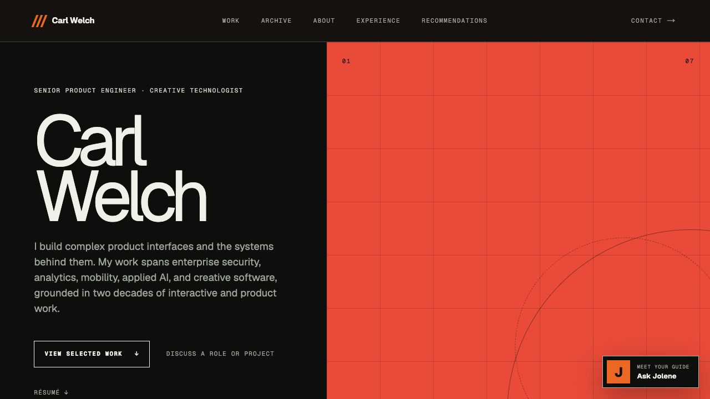
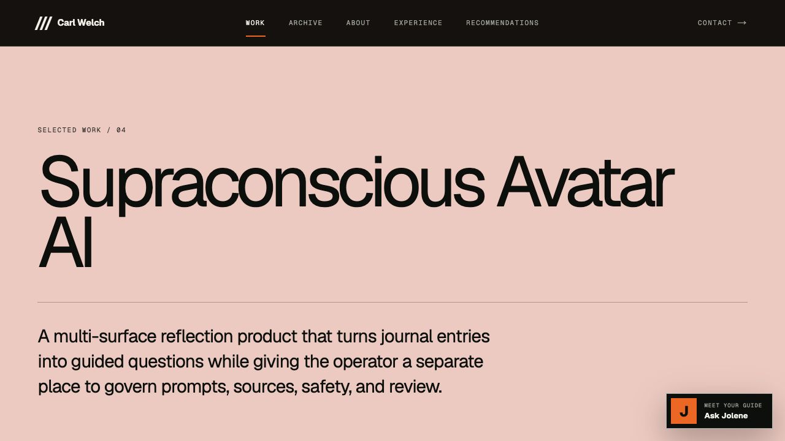
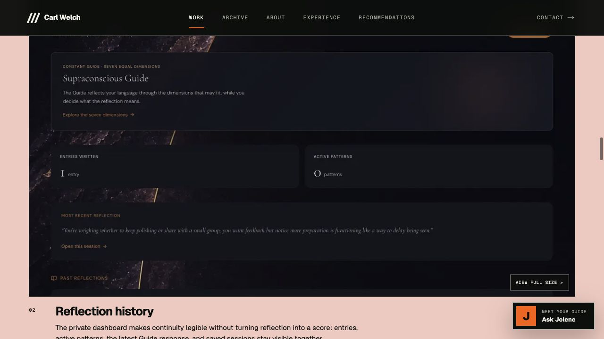
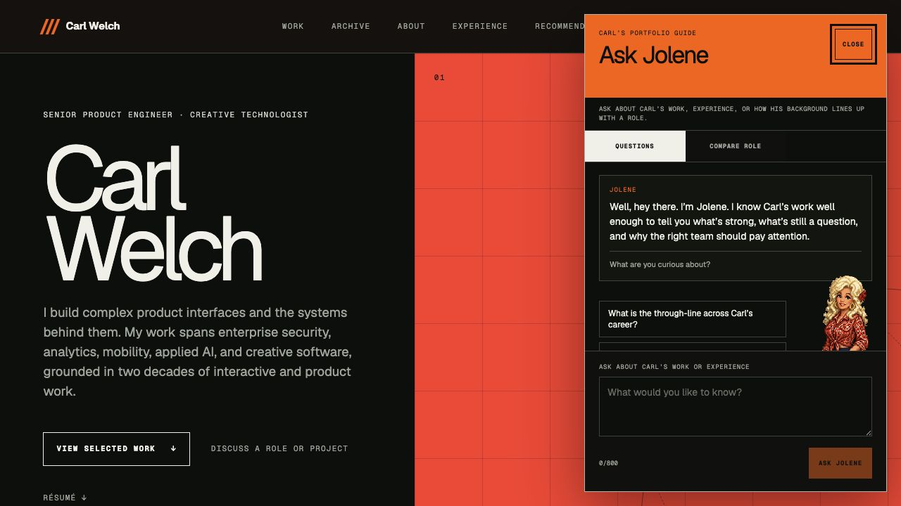
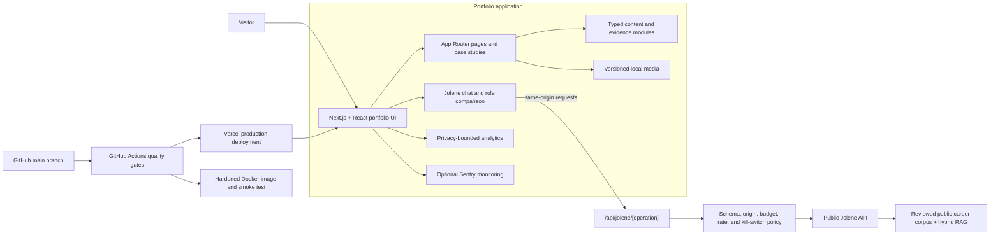

# Carl Welch Portfolio

A production portfolio for senior product engineer and creative technologist Carl Welch. The site combines evidence-backed case studies, a career archive, interactive system diagrams, and Jolene, a public AI guide grounded in reviewed career evidence.

**Live site:** [carl-welch-portfolio.vercel.app](https://carl-welch-portfolio.vercel.app/)

## Product

The portfolio is designed as a product system rather than a static gallery. It presents seven flagship case studies across applied AI, aviation intelligence, audio software, reflection systems, private-service concepts, knowledge systems, and creative music technology.

The experience includes:

- Detailed case studies with product status, contribution boundaries, implementation evidence, and architecture views
- A curated archive connecting current engineering work to two decades of interactive and product practice
- Responsive project galleries with locally versioned media
- Jolene, an animated portfolio guide for questions and role comparison
- Privacy-bounded analytics and optional Sentry observability
- Automated content, security, accessibility, browser, container, and AI-contract verification

## Screenshots

### Portfolio homepage



### Case-study presentation



### Product evidence



### Jolene portfolio guide



## System architecture



### Runtime boundaries

- The browser calls only same-origin portfolio routes. It never receives the upstream Jolene token or service origin.
- The Jolene BFF validates bounded request and response schemas, applies rate and cost controls, and fails closed when required configuration or corpus compatibility is missing.
- Public Jolene uses a separately deployed, read-only career delegate. Private memory, Obsidian content, private MCP tools, and owner actions are outside this repository and outside the public service boundary.
- Portfolio content and media are versioned in the repository. Remote project metadata is reviewed before publication rather than copied directly into public claims.
- Production runs on Vercel. Vinext and Docker provide local, preview, and hardened-container verification paths.

## Technology

- Next.js 16, React 19, and TypeScript
- Vinext and Vite for local and portable builds
- Motion for interface animation
- Playwright and axe-core for browser and accessibility checks
- Vercel for production hosting
- Docker and Trivy for hardened image verification
- Optional Sentry browser and worker observability

## Repository layout

The deployable application lives directly at repository root.

```text
app/            Routes, UI, content models, Jolene, security, observability
art-source/     Reviewed Jolene source art and generated sprite evidence
contracts/      Public Jolene OpenAPI and reviewed evidence manifest
docs/           Product policies, runbooks, QA evidence, and README media
evaluations/    Versioned public Jolene evaluation policy
public/         Portfolio imagery, project media, archive assets, and sprites
scripts/        Content, security, build, asset, and release verification
tests/          Browser regression and capability coverage
```

The root layout is enforced by `pnpm check:repository-layout`. The check rejects a nested `site/` wrapper, obsolete planning collateral, and stale CI or Dependabot paths.

## Local development

Requirements:

- Node.js 22.13 or newer
- Corepack with pnpm

```bash
corepack enable
pnpm install --frozen-lockfile
pnpm dev
```

The development server prints its local URL. Public values can be copied from `.env.example`; secrets belong only in ignored `.env*` files or provider secret stores.

### Jolene modes

- `NEXT_PUBLIC_JOLENE_MODE=disabled` hides the guide.
- `NEXT_PUBLIC_JOLENE_MODE=fixture` runs deterministic local scenarios.
- `NEXT_PUBLIC_JOLENE_MODE=live` enables the same-origin BFF and requires the server-side public Jolene configuration.

No upstream credential may use a `NEXT_PUBLIC_` variable.

## Verification

```bash
pnpm check
pnpm check:browser
pnpm check:jolene-ui
```

`pnpm check` runs the root-layout contract, TypeScript, ESLint, content and editorial boundaries, social-card integrity, public Jolene contracts, BFF security policy, avatar asset checks, analytics and Sentry privacy checks, release readiness, the production build, and source-map leakage checks.

The browser suites cover responsive layout, accessibility, route behavior, project media, Jolene state transitions, reduced motion, service failures, and the visible request-loading animation.

## Container verification

```bash
docker compose up --build
```

The production-mode image runs as an unprivileged user with a read-only root filesystem, bounded temporary storage, no Linux capabilities, and no-new-privileges. CI scans the image for high and critical vulnerabilities before starting the hardened smoke-test container.

## Deployment

Pull requests create Vercel previews and run the complete GitHub Actions gate. Merges to `main` deploy the repository root to production. The release is complete only after the deployment is ready and the public routes, media, Jolene behavior, and runtime errors are checked against the live site.

## Additional documentation

- [Production operations](docs/PRODUCTION_OPERATIONS_RUNBOOK.md)
- [Repository security](docs/REPOSITORY_SECURITY_OPERATIONS.md)
- [Regression-test policy](docs/REGRESSION_TEST_POLICY.md)
- [Jolene BFF threat model](docs/JOLENE_BFF_THREAT_MODEL.md)
- [Analytics privacy policy](docs/PORTFOLIO_ANALYTICS_POLICY.md)
- [Project media sources](docs/PROJECT_MEDIA_SOURCES.md)
